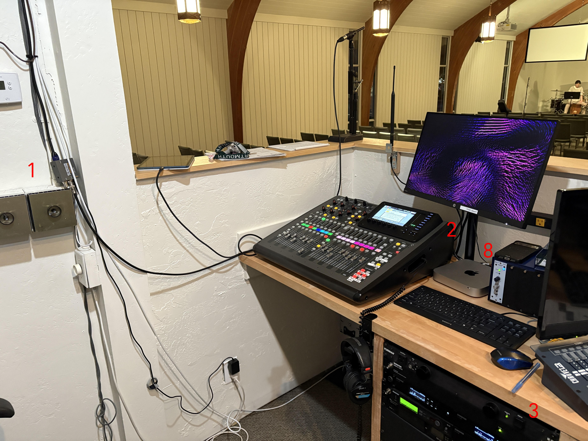
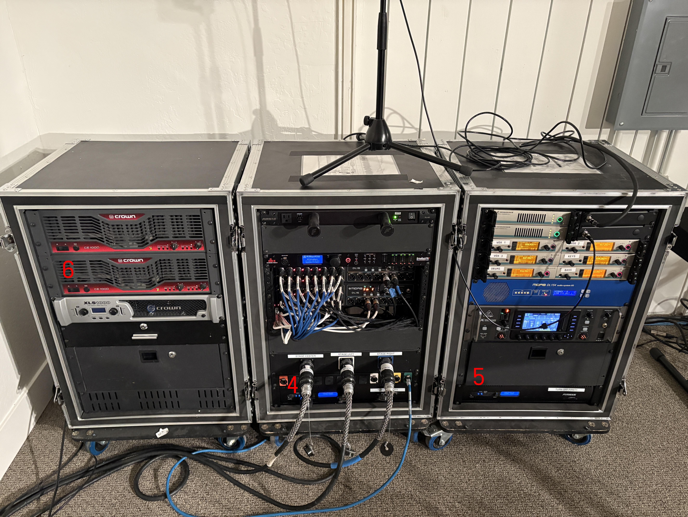
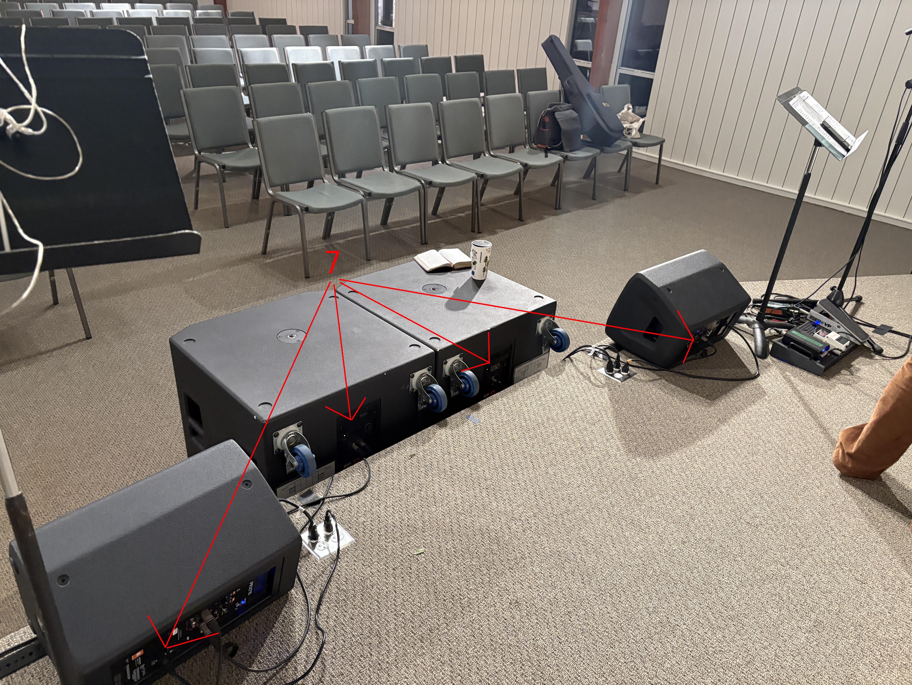

# garden-city-tech-docs
Garden City Technical Documentation

## Setup

### Front of House

1. Lights **ON** - spinners to the left of the board
2. Board **ON**
3. Under desk rack **ON**

Image Summary

### Stage Left - Upstage - Racks

4. Middle rack - UPS power **ON**
    * Wait until there are clicks - 10-15 seconds
5. Right rack (downstage) - UPS power **ON**
    * Wait until there are clicks - 10-15 seconds
6. Left rack (upstage) - racked amplifiers **ON**
    * Need both top and "middle" amp on
    * Order unimportant

Image Summary

### Center Stage - Downstage - Speakers and Subs

7. Speakers and subs **ON**
    * Order unimportant
    * Front fill speakers are a switch - no need to verify
    * Subs are janky

Image Summary

### Front of House

8. Power on Mac Mini
    * Password: `Jesus!!!`

Image Summary

## Running the Room

* House right
    * Deadens bass
    * Watch for upper range feedback through backup vocal mic
* House left
    * More bass

## Teardown

* Inverse of power up

### Center Stage - Downstage - Speakers and Subs

1. Speakers and subs **OFF**

### Stage Left - Upstage - Racks

2. Left rack (upstage) - racked amplifiers **OFF**
3. Right rack (downstage) - UPS power **OFF**
4. Middle rack - UPS power **OFF**

### Front of House

5. Mac Mini **OFF**
6. Under desk rack **OFF**
7. Console **OFF**
8. Lights **OFF**
